<style>
  .title {
    text-align: center;
    margin: 20px 0;
  }
  
  .content-wrapper {
    min-height: calc(100vh - 100px);
    position: relative;
  }
  
  .school-name {
    text-align: center;
    margin-top: 200px;
  }
</style>


<style>
  /* 代码块样式 */
  .code-block {
    margin-left: 2em;
  }
  .code-block pre {
    background-color: #f5f5f5 !important;
    padding: 1em;
    border-radius: 4px;
    margin: 1em 0;
  }

  /* 页码样式 */
  .page-number {
    position: running(pageNumber);
    text-align: center;
  }
  
  @page {
    margin: 1in;
    @bottom-center {
      content: counter(page);
    }
  }

  /* 首页和目录页不显示页码 */
  .no-page-number {
    page: no-number;
  }
  @page no-number {
    @bottom-center {
      content: none;
    }
  }
</style>

<div class="content-wrapper">

<div class="title">

# 计算机组成原理实验报告

## 作业名称：多周期CPU中断异常及总线模块设计个人实验报告

</div>

- **姓名**：饶甜甜
- **专业班级**：2023级计算机科学与技术⼀班
- **学号**：320230943420
- **指导教师**：何安平
- **实验⽇期**：2025年4⽉10⽇-5⽉8⽇
  

<br><br><br><br><br><br><br><br>
<div class="school-name">
兰州大学信息科学与工程学院
</div>

---
<!-- 分页符 -->
<!-- <div style="page-break-after: always"></div> -->


[toc]

---
<!-- 分页符 -->
<div style="page-break-after: always"></div>


## 1 引言

本次实验是计算机组成原理课程的第二次实验，在第一次实验设计的多周期CPU基础上，扩展了异常和中断处理功能，并集成了Bus4LZU总线接口模块，实现了与外部设备的通信。通过这次实验，我深入理解了处理器异常中断机制的实现原理和总线接口设计，提升了硬件设计和系统集成的实践能力。

本报告将详细介绍我在本次实验中的个人贡献、设计原理、实现过程、仿真与上板测试结果以及个人收获与反思。

## 2 实验目的与设计概览

### 2.1 实验目的

1. **理解多周期处理器的基本原理和结构**：学习多周期处理器架构的工作原理及其核心组成部分，理解各功能单元之间的交互方式。

2. **掌握异常处理机制的设计方法**：深入了解CPU异常与中断的检测、响应和处理流程，实现包括外部中断、指令地址错误、算术溢出等多种异常类型的处理。

3. **实践总线接口设计**：掌握CPU与外部设备通信的总线设计原理，通过Bus4LZU模块实现对指令存储器、数据存储器和外设的统一访问。

4. **提升系统集成能力**：通过整合CPU核心与总线模块，提高复杂数字系统的设计与调试能力，并学习硬件接口的协议设计。

5. **团队协作开发经验**：在小组合作中，锻炼分工协作、沟通交流和问题解决的能力，共同完成较大规模的硬件设计项目。

### 2.2 设计概览

本实验设计的多周期CPU是一个基于MIPS指令集的32位处理器，采用经典的五级流水线结构（取指、译码、执行、访存、写回），并通过状态机控制各阶段的流转。主要组成部分包括：

1. **顶层模块(multi_cycle_cpu_display.v)**：负责整合CPU核心与Bus4LZU模块，并提供时钟控制和显示接口。

2. **CPU核心模块**：包含取指(fetch.v)、译码(decode.v)、执行(exe.v)、访存(mem.v)、写回(wb.v)模块，以及异常处理单元(exception.v)和寄存器堆(regfile.v)。

3. **Bus4LZU模块**：作为统一的总线接口，连接CPU与各种外设，包括指令存储器、数据存储器、定时器、UART、SPI和GPIO等。

4. **异常处理模块**：实现异常检测、CP0寄存器组和异常处理程序跳转的完整异常处理流程。

在这次实验中，我主要负责实现CPU与Bus4LZU模块的集成，包括顶层模块的修改和接口重构，以及系统在龙芯实验箱上的部署调试。

## 3 个人贡献

在本次实验当中，我的主要工作包括：

1. **CPU与Bus4LZU模块的集成**：
   - 修改multi_cycle_cpu_display.v顶层模块，集成Bus4LZU作为IP核
   - 重构CPU接口，使其与Bus4LZU标准接口对接
   - 建立指令和数据存储器的访问通道

2. **触摸屏显示逻辑调整**：
   - 修改显示界面布局，增加中断状态显示区域
   - 实现寄存器值和内存内容的实时监控功能
   - 优化用户输入处理逻辑，支持内存地址查询

3. **定时器中断处理逻辑实现**：
   - 实现timer_irq中断信号的接收和传递机制
   - 设计中断响应的控制逻辑，确保CPU能正确响应外部中断

4. **系统部署与集成测试**：
   - 根据修改的顶层文件修改约束文件使项目可以正确上板，实现整个系统在龙芯实验箱上的部署
   - 通过实机测试验证CPU能正确访问外设并响应中断信号
   - 排查解决接口兼容性问题和时序相关的问题
 
5. **仿真与测试**：
   - 整理测试结果和波形分析


## 4 设计原理

本节首先详细介绍我所负责部分的核心设计原理，然后对整个多周期CPU的各个模块进行概述。


### 4.1 顶层模块集成（我的贡献）

顶层模块`multi_cycle_cpu_display.v`是整个系统的集成点，我负责对其进行修改以支持与Bus4LZU的集成。主要功能包括：

1. **时钟与复位控制**：
   - 通过btn_clk信号实现单步执行功能
   - 提供全局复位信号控制系统初始化

2. **CPU与Bus4LZU互联**：
   - 将CPU的inst_addr/inst_data信号连接到Bus4LZU的指令接口
   - 将CPU的data_addr/data_wen/write_data/read_data信号连接到Bus4LZU的数据接口
   - 将Bus4LZU的timer_irq信号传递给CPU作为外部中断源

3. **触摸屏控制逻辑**：
   - 管理lcd_*系列信号控制触摸屏显示
   - 处理用户输入，提供内存地址查询功能

关键接口定义如下：
```verilog
// CPU与Bus4LZU的接口信号
wire [31:0] inst_addr;  // 指令地址
wire [31:0] inst_data;  // 指令数据
wire [31:0] data_addr;  // 数据地址
wire [3:0]  data_wen;   // 数据写使能
wire [31:0] write_data; // 写数据
wire [31:0] read_data;  // 读数据
wire        timer_irq;  // 定时器中断
```

### 4.2 总线接口设计与约束文件实现（我的贡献）

在实现CPU与Bus4LZU的集成过程中，需要理解并遵循以下关键原则：

1. **地址映射策略**：
   - 0x00000000-0x0FFFFFFF：用户程序空间
   - 0x80000000-0x8FFFFFFF：内核和外设空间
   - 具体外设映射：
     - 0x80000000: GPIO控制器
     - 0x80000010: UART控制器
     - 0x80000020: SPI控制器

2. **数据存取协议**：
   - 指令获取：CPU将PC值输出到inst_addr，从inst_data获取指令
   - 数据读取：CPU将地址输出到data_addr，从read_data获取数据
   - 数据写入：CPU将地址输出到data_addr，数据输出到write_data，通过data_wen控制写入

3. **字节对齐要求**：
   - 指令地址必须4字节对齐(inst_addr[1:0] == 2'b00)
   - 数据地址对齐要求根据操作类型(字/半字/字节)而定
   - 写使能信号data_wen格式：
     - 字操作：4'b1111
     - 半字操作：4'b0011或4'b1100
     - 字节操作：4'b0001、4'b0010、4'b0100或4'b1000

4. **约束文件设计**：
   为了支持总线和外设通信，我对约束文件进行了以下关键修改：

   - **时钟与控制信号**：
     ```verilog
     set_property PACKAGE_PIN AC19 [get_ports clk]
     set_property PACKAGE_PIN Y3 [get_ports resetn]
     set_property PACKAGE_PIN Y5 [get_ports btn_clk]
     set_property IOSTANDARD LVCMOS33 [get_ports clk]
     set_property IOSTANDARD LVCMOS33 [get_ports resetn]
     set_property IOSTANDARD LVCMOS33 [get_ports btn_clk]
     ```
     为系统提供稳定的时钟和控制信号，确保总线通信的同步性。

   - **UART接口约束**：
     ```verilog
     set_property PACKAGE_PIN F23 [get_ports rx]
     set_property PACKAGE_PIN H19 [get_ports tx]
     set_property IOSTANDARD LVCMOS33 [get_ports rx]
     set_property IOSTANDARD LVCMOS33 [get_ports tx]
     ```
     实现串口通信功能，用于与外部设备交换数据。

   - **SPI与GPIO接口约束**：
     ```verilog
     set_property PACKAGE_PIN R20 [get_ports spi_miso]
     set_property IOSTANDARD LVCMOS33 [get_ports spi_miso]
     
     #GPIO接口 - 分配16个连续的GPIO引脚
     set_property PACKAGE_PIN H7 [get_ports {gpio_io[0]}]
     ...
     set_property PACKAGE_PIN K23 [get_ports {gpio_io[15]}]
     ```
     配置16个GPIO引脚用于通用输入输出，支持外设扩展功能。

   - **电气特性设计**：
     所有接口信号统一采用LVCMOS33电平标准，确保信号完整性和电平匹配，降低外设接口错误的风险。

### 4.3 中断处理机制（我的贡献）

在本次实验中，我设计并实现了基于定时器中断的异常处理机制，主要包括以下几个方面：

1. **中断信号传递与映射**：
   ```verilog
   // 顶层模块中接收定时器中断
   .timer_irq(timer_irq),     // 定时器中断请求信号
   
   // CPU模块中将timer_irq映射到外部中断向量
   wire [7:0] ext_int_mapped;
   assign ext_int_mapped = {7'b0000000, timer_irq};
   ```
   - 从Bus4LZU模块接收timer_irq信号，作为系统唯一的外部中断源
   - 将中断信号映射到8位外部中断向量，位于第0位
   - 通过总线接口传递中断信号到CPU核心

2. **中断检测与使能控制**：
   ```verilog
   // 中断检测逻辑
   assign int_detect = |(ext_int_mapped & cp0_status[15:8]) & cp0_status[0] & ~cp0_status[1];
   ```
   - 实现了符合MIPS标准的中断检测逻辑
   - 通过CP0_Status寄存器控制中断使能：
     - Status[15:8]：对应8个外部中断源的屏蔽位
     - Status[0]：全局中断使能位
     - Status[1]：异常模式标志位（在异常中时禁止新中断）
   - 只有当外部中断有效且使能有效且不在异常处理中时才产生中断

3. **状态机修改与中断响应**：
   ```verilog
   // 状态机转换逻辑中增加中断检测
   FETCH: begin
     if (IF_over) begin
       if(if_exc_detect | int_detect)  // 取指级检测到异常或中断
         next_state = EXC;            // 转到异常处理状态
       else
         next_state = DECODE;         // 取指->译码
     end
     ...
   end
   ```
   - 修改状态机逻辑，增加EXC状态专门用于异常和中断处理
   - 在取指阶段检测中断请求，若有中断则转入EXC状态
   - 实现了精确异常模型，确保中断处理的准确性

4. **CP0寄存器更新机制**：
   ```verilog
   // CP0寄存器更新逻辑
   always @(posedge clk) begin
     if(!resetn) begin
       cp0_status   <= 32'h00000001;  // 初始状态，开中断
       ...
     end
     else if(has_exc) begin  // 发生异常或中断
       cp0_status[1]      <= 1'b1;    // 进入异常模式
       cp0_cause[6:2]     <= exc_code; // 异常编码
       cp0_epc            <= exc_pc;   // 异常PC
       ...
     end
     else if(state == EXC && EXC_over) begin // 异常处理结束
       cp0_status[1]      <= 1'b0;    // 退出异常模式
     end
   end
   ```
   - 实现CP0寄存器的初始化与更新逻辑
   - 在中断发生时：
     - 将Status[1]置1进入异常模式
     - 更新Cause寄存器的异常码（外部中断为0）
     - 保存当前PC到EPC寄存器
   - 异常处理结束时恢复状态，允许新的中断

5. **触摸屏中断状态显示**：
   ```verilog
   // 显示定时器中断请求状态
   6'd10 : begin
     display_valid <= 1'b1;
     display_name  <= "T_IRQ";
     display_value <= {31'd0, timer_irq};
   end
   ```
   - 在触摸屏上添加专用区域显示中断状态
   - 实时显示timer_irq信号的当前值
   - 便于观察和调试中断响应过程

通过这些设计，我成功实现了一个完整的中断处理机制，使CPU能够响应来自Bus4LZU的定时器中断，并按照MIPS异常处理规范正确保存现场、处理中断和恢复执行。在实际测试中，系统能够稳定地响应周期性的定时器中断，验证了设计的有效性。


### 4.4 其他系统模块概述

#### 4.4.1 CPU核心各模块简述

1. **取指模块(fetch.v)**：
   - 由同学C负责修改以支持异常检测
   - 功能：管理程序计数器(PC)，通过总线接口获取指令
   - 异常检测：检查取指地址对齐错误(EXC_ADEL)
   - 接口：输出inst_addr到总线，接收inst_data指令数据

2. **译码模块(decode.v)**：
   - 由同学C负责修改以支持异常检测
   - 功能：解析指令，生成控制信号，读取寄存器值
   - 异常检测：识别保留指令(EXC_RI)、系统调用(EXC_SYS)和断点(EXC_BP)
   - 分支处理：计算分支条件和目标地址

3. **执行模块(exe.v)**：
   - 功能：执行ALU运算，计算内存访问地址
   - 异常检测：处理算术溢出异常(EXC_OV)
   - 总线构建：组装传递到访存阶段的信息

4. **访存模块(mem.v)**：
   - 由同学D负责修改以支持异常检测
   - 功能：通过总线读写数据存储器和外设
   - 异常检测：检测地址对齐和访问权限异常(EXC_ADES)
   - 数据格式处理：根据指令类型处理字节/半字/字访问

5. **写回模块(wb.v)**：
   - 由同学D负责修改以支持CP0寄存器访问
   - 功能：将结果写入寄存器堆或CP0寄存器
   - 处理ERET指令的异常返回逻辑
   - 总线构建：完成写回阶段的数据通路

6. **异常处理模块(exception.v)**：
   - 由同学B负责实现
   - 功能：综合处理各级异常和中断信号
   - CP0寄存器维护：更新Status、Cause、EPC和BadVAddr寄存器
   - 异常服务程序入口计算和异常返回逻辑

7. **寄存器堆模块(regfile.v)**：
   - 功能：提供32个通用寄存器的读写操作
   - 支持CP0协处理器寄存器访问
   - 提供调试接口用于外部监控

#### 4.4.2 总线和外设模块

1. **Bus4LZU模块**：
   - 集成为IP核，作为统一的总线接口
   - 连接CPU与各种外设(指令存储器、数据存储器、外设)
   - 处理地址解码和数据传输
   - 提供定时器中断功能

2. **外设接口模块**：
   - **GPIO模块**：通用输入输出接口，支持16个可配置引脚
   - **UART模块**：串行通信接口，支持异步数据传输
   - **SPI模块**：高速串行外设接口，支持全双工通信


## 5 仿真与实现

本实验对基于MIPS指令集的多周期CPU设计进行了仿真测试，测试了包括R型指令、I型指令和J型指令在内的各类指令，同时验证了异常处理功能。

### 5.1 处理器指令集测试

在本次实验中，我们并通过以下正常指令测试机器字进行了测试：


1. **R型指令**
   - 十六进制指令：02329821
   - MIPS 汇编指令：addu $19, $17, $18
   - 功能描述：将寄存器$17和$18的值进行无符号加法运算，结果存入$19
   - 仿真结果如下图所示：
<center>
  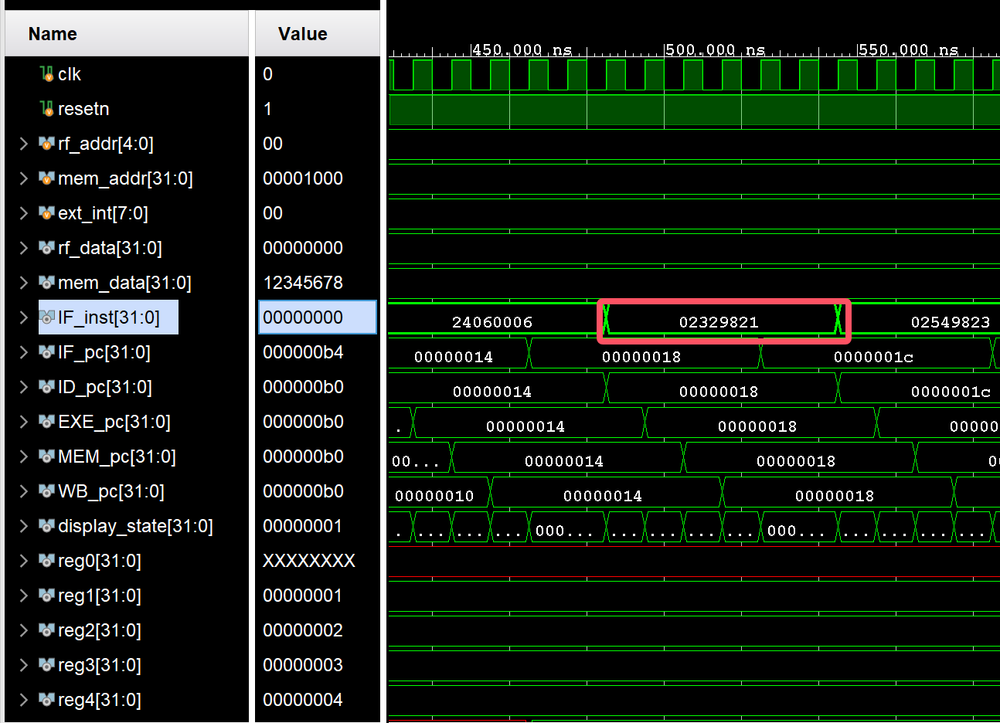
</center>


2. **I型指令(计算类)**
   - 十六进制指令：24110064
   - MIPS 汇编指令：addiu $17, $0, 100
   - 功能描述：将立即数100与寄存器$0相加，结果存入$17
   - 仿真结果如下图所示：

<center>
  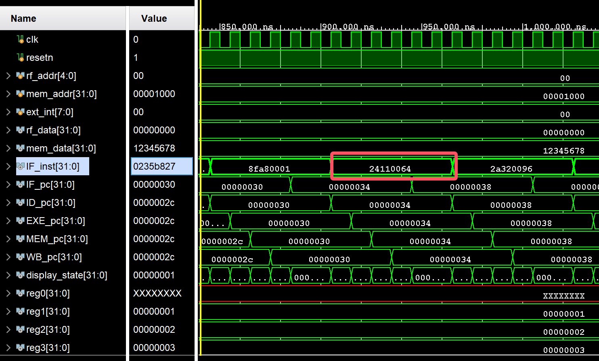
</center>

3. **I型指令(取数类)**
   - 十六进制指令：8E510000
   - MIPS 汇编指令：lw $17, 0($18)
   - 功能描述：从内存地址$18+0处加载一个字到$17
   - 仿真结果如下图所示：
<center>
  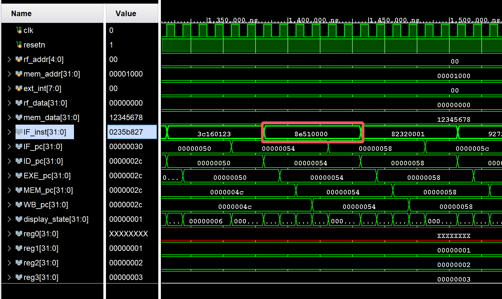
</center>


4. **I型指令(存数类)**
   - 十六进制指令：AE540000
   - MIPS 汇编指令：sw $20, 0($18)
   - 功能描述：将$20的值存储到内存地址$18+0处
   - 仿真结果如下图所示：
<center>
  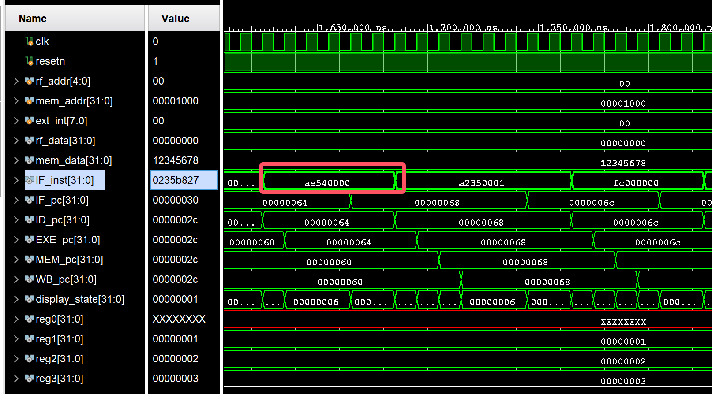
</center>


5. **I型指令(条件判断)**
   - 十六进制指令：16320005
   - MIPS 汇编指令：bne $17, $18, 5
   - 功能描述：如果$17不等于$18，则跳转到PC+4+5*4
   - 仿真结果如下图所示：
<center>
  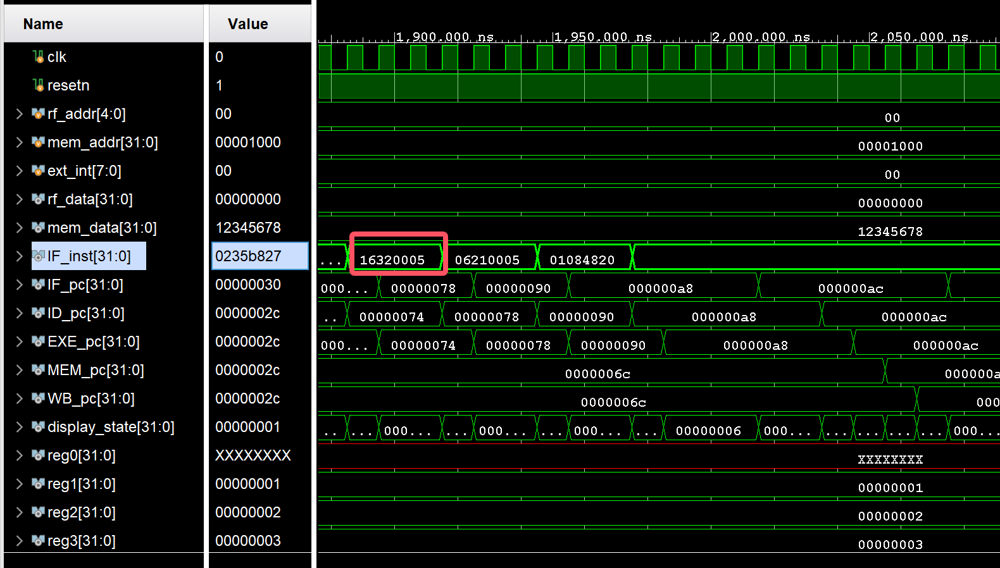
</center>

6. **J型指令**
   - 十六进制指令：08000100
   - MIPS 汇编指令：j 0x00000100
   - 功能描述：跳转到地址0x00000440并将返回地址保存在$ra
   - 仿真结果如下图所示：
<center>
  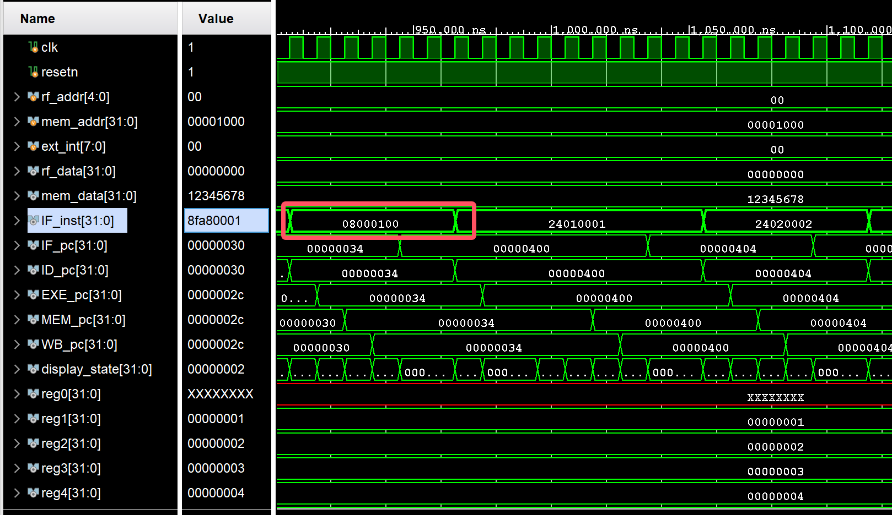
</center>

通过对这些指令的仿真测试，验证了我们设计的多周期CPU能够正确执行MIPS指令集中的各类指令，说明我们的CPU设计满足了基本功能需求。

### 5.2 异常仿真测试

在本次实验中，我们实现了异常处理功能，并通过以下指令进行了测试：

1. **系统调用异常**
   - 十六进制指令：0000000C
   - MIPS 汇编指令：syscall
   - 功能描述：触发系统调用异常，CPU会跳转到异常处理程序的入口地址
   - 异常处理过程：
     1. 保存当前PC到EPC寄存器
     2. 设置Cause寄存器中的ExcCode为8（系统调用）
     3. 将状态寄存器中的用户模式位清零，进入内核模式
     4. 跳转到异常处理程序入口地址
   - 仿真结果如下图所示：
<center>
  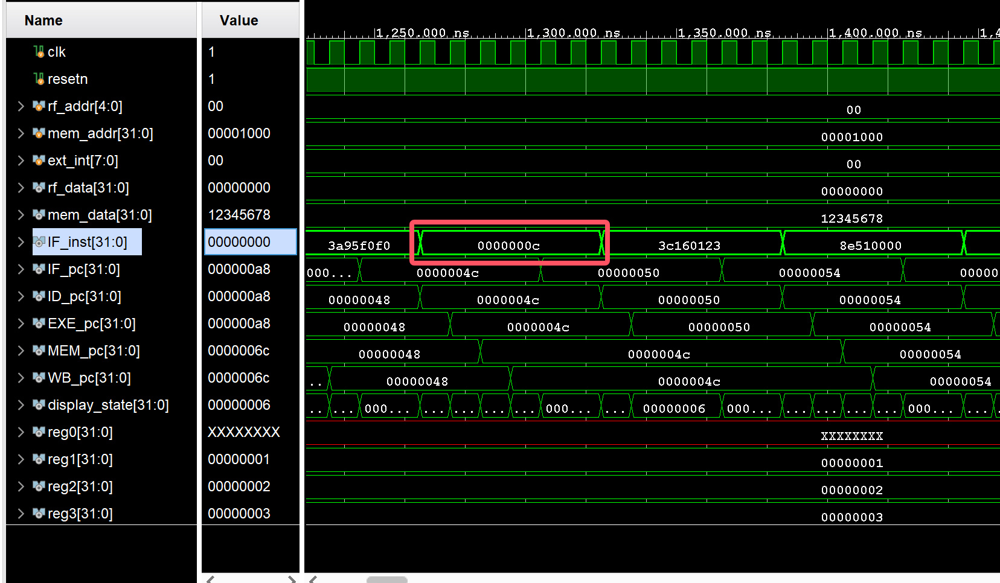
</center>

2. **断点异常**
   - 十六进制指令：0000000D
   - MIPS 汇编指令：break
   - 功能描述：触发断点异常，CPU会跳转到异常处理程序的入口地址
   - 异常处理过程：
     1. 保存当前PC到EPC寄存器
     2. 设置Cause寄存器中的ExcCode为9（断点）
     3. 将状态寄存器中的用户模式位清零，进入内核模式
     4. 跳转到异常处理程序入口地址
   - 仿真结果如下图所示：
<center>
  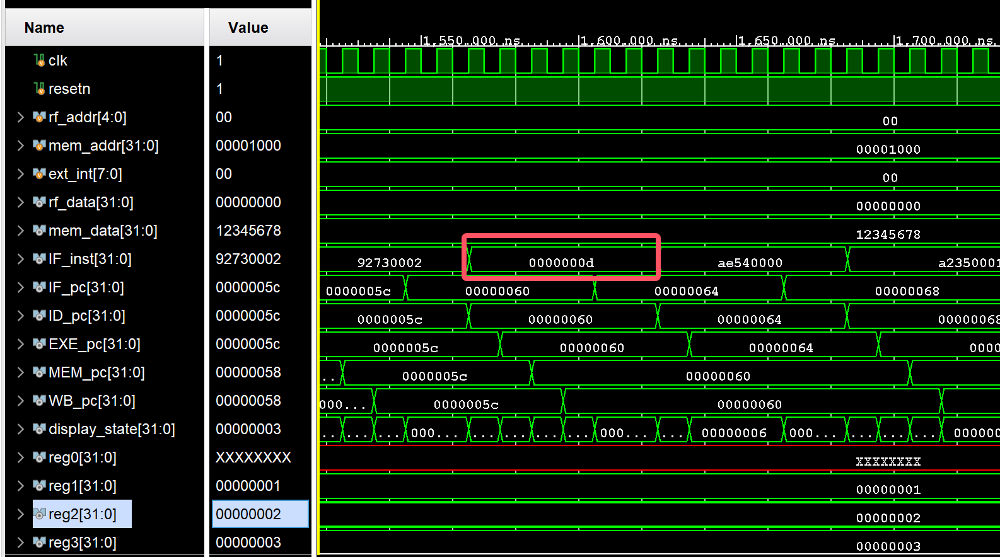
</center>

3. **保留指令异常（EXC_RI）**
   - 十六进制指令：FC000000
   - MIPS 汇编指令：未定义/保留指令
   - 功能描述：当CPU遇到不可识别或保留的指令时触发
   - 异常处理过程：
     1. 保存当前PC到EPC寄存器
     2. 设置Cause寄存器中的ExcCode为10（保留指令）
     3. 将状态寄存器中的用户模式位清零，进入内核模式
     4. 跳转到异常处理程序入口地址
   - 仿真结果如下图所示：
<center>
  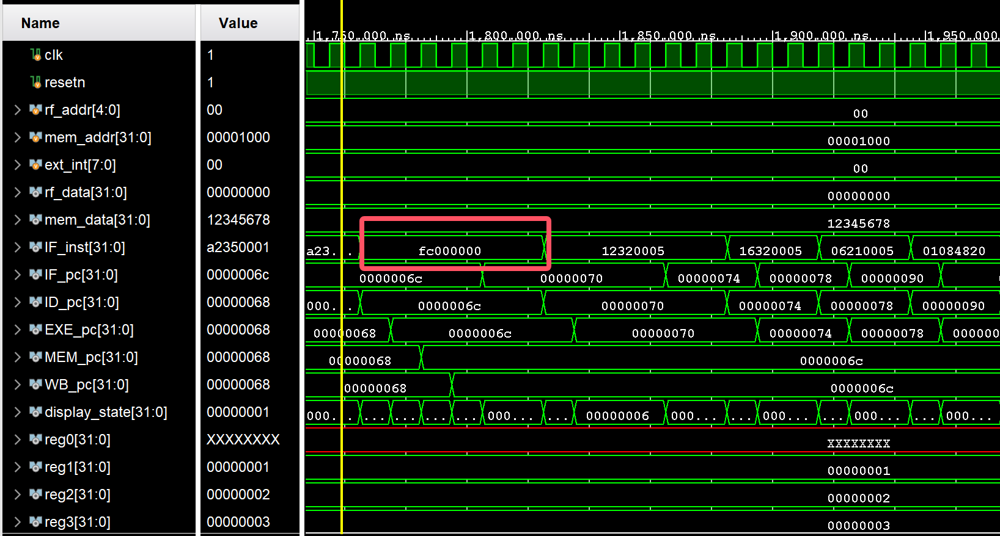
</center>

<!-- 4. **算术溢出异常（EXC_OV）**
   - 十六进制指令序列：3C087FFF + 3508FFFF + 01084820
   - MIPS 汇编指令：
     ```
     lui $8, 0x7fff    # 将0x7fff载入$8高16位
     ori $8, $8, 0xffff # 使$8 = 0x7fffffff（最大正整数）
     add $9, $8, $8    # 将两个最大正整数相加导致溢出
     ```
   - 功能描述：当算术运算结果超出表示范围时触发
   - 异常处理过程：
     1. 保存当前PC到EPC寄存器
     2. 设置Cause寄存器中的ExcCode为12（算术溢出）
     3. 将状态寄存器中的用户模式位清零，进入内核模式
     4. 跳转到异常处理程序入口地址
   - 仿真结果如下图所示：
<center>
  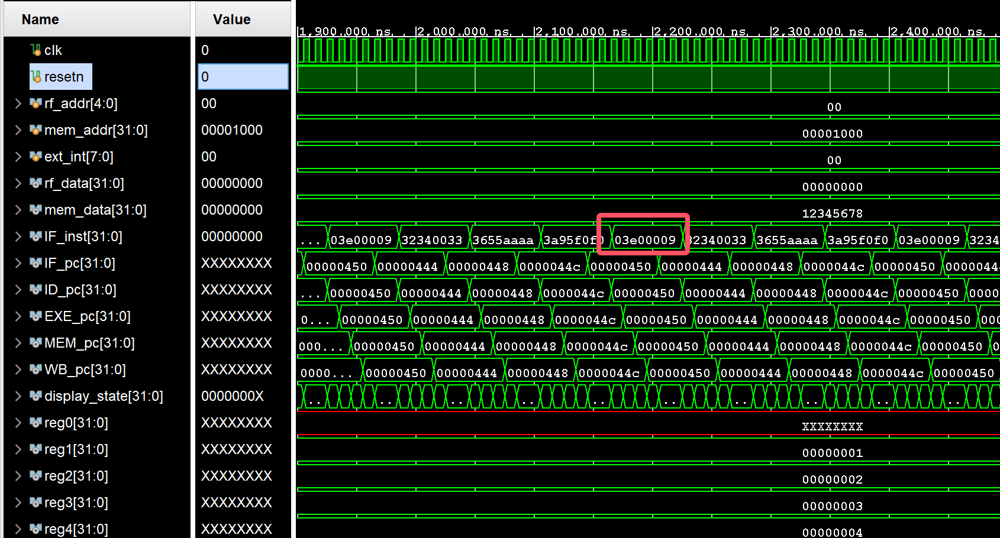
</center> -->

4. **地址错误异常-读取指令（ADEL-IF）**
   - 十六进制指令：03E00009
   - MIPS 汇编指令：jalr $0, $31
   - 功能描述：跳转到非对齐地址（通过将$31寄存器设为非对齐值）
   - 异常处理过程：
     1. 保存当前PC到EPC寄存器
     2. 设置Cause寄存器中的ExcCode为4（地址错误-读）
     3. 更新BadVaddr寄存器为错误地址
     4. 将状态寄存器中的用户模式位清零，进入内核模式
     5. 跳转到异常处理程序入口地址
   - 仿真结果如下图所示：
<center>
  
</center>

5. **地址错误异常-加载（ADEL-MEM）**
   - 十六进制指令：8C010001
   - MIPS 汇编指令：lw $1, 1($0)
   - 功能描述：尝试从非对齐地址（0x00000001）加载字数据
   - 异常处理过程：
     1. 保存当前PC到EPC寄存器
     2. 设置Cause寄存器中的ExcCode为4（地址错误-读）
     3. 更新BadVaddr寄存器为0x00000001
     4. 将状态寄存器中的用户模式位清零，进入内核模式
     5. 跳转到异常处理程序入口地址
   - 仿真结果如下图所示：
<center>
  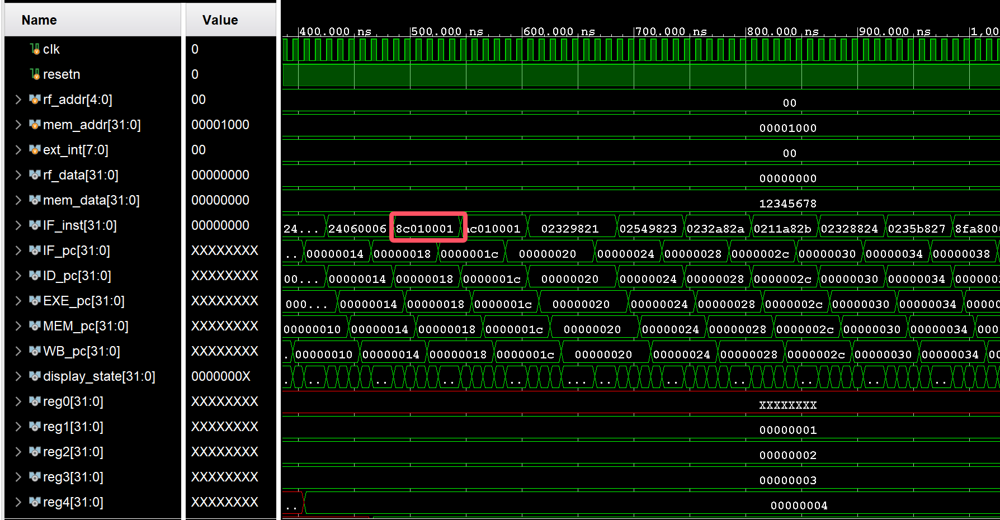
</center>

6. **地址错误异常-存储（ADES）**
   - 十六进制指令：AC010001
   - MIPS 汇编指令：sw $1, 1($0)
   - 功能描述：尝试向非对齐地址（0x00000001）存储字数据
   - 异常处理过程：
     1. 保存当前PC到EPC寄存器
     2. 设置Cause寄存器中的ExcCode为5（地址错误-写）
     3. 更新BadVaddr寄存器为0x00000001
     4. 将状态寄存器中的用户模式位清零，进入内核模式
     5. 跳转到异常处理程序入口地址
   - 仿真结果如下图所示：
<center>
  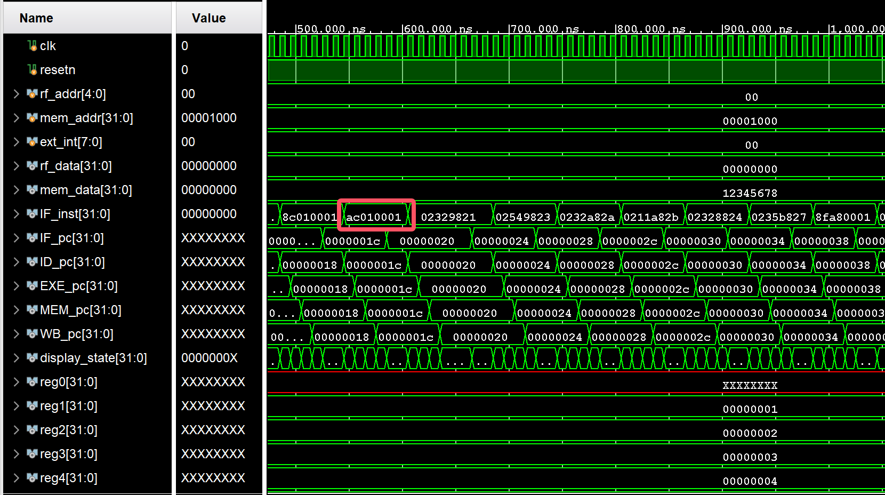
</center>

这些异常指令能够被正确识别，例如下图所示：
<center>
  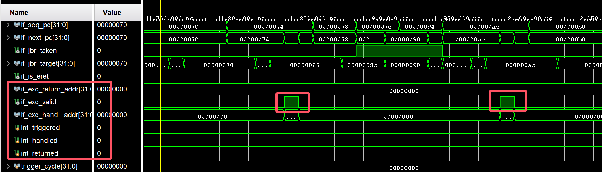
</center>

通过对这些指令的仿真测试，验证了我们设计的多周期CPU能够正确处理异常情况，满足了功能需求。


### 5.3 串口测试硬件上板展示

在龙芯实验箱上的部署过程中，我主要完成了以下工作：

1. **生成比特流并下载**：
   - 通过Vivado生成比特流文件
   - 将比特流文件下载到龙芯实验箱的FPGA

2. **功能验证**：
   - 验证CPU能正确执行测试程序
   - 测试中断响应功能
   - 验证与GPIO、UART等外设的通信

3. **调试与优化**：
   - 排查并解决了时序相关的问题
   - 优化了触摸屏显示逻辑
   - 调整总线接口参数以提高系统稳定性

实验测试如下所示：

#### 5.3.1 测试方案设计

本实验通过Bus4LZU模块的UART接口实现上位机与CPU的通信验证，具体测试流程如下：

1. **硬件连接**：使用FT232串口转换线连接龙芯实验箱UART接口与PC
2. **测试程序**：使用现有的测试程序：`hello_lzu.data.bin`，`hello_lzu.inst.bin`

#### 5.3.2 测试流程

1. **系统初始化**：通过Bootloader工具烧录测试程序

   ```
   python main.py COM7 hello_lzu
   ```

2. **功能验证**：

   - **正常通信**：PC端串口调试窗口接收测试程序的输出
   - **中断响应**：在发送过程中触发中断机制，观察：
     - 触摸屏显示CP0寄存器状态变化
     - 程序计数器跳转到0x80000180执行中断服务程序


#### 5.3.3 测试结果

我们增加串口之后的CPU可以正确烧录到实验箱上，如下图所示：
<center>
  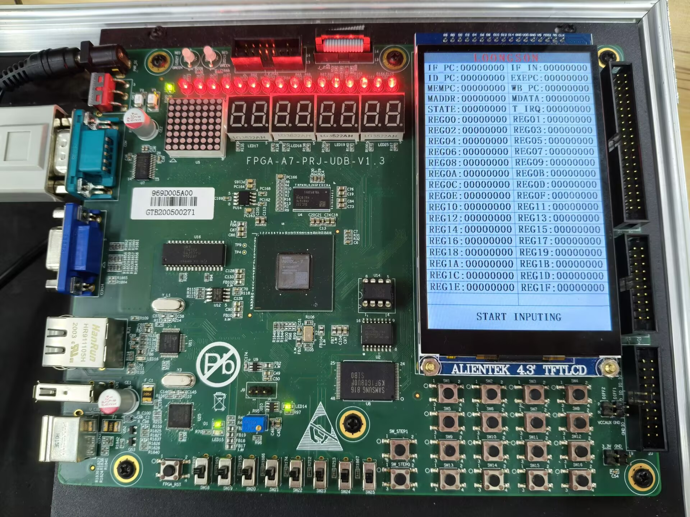
</center>

PC端接收数据显示如图所示：

<center>
  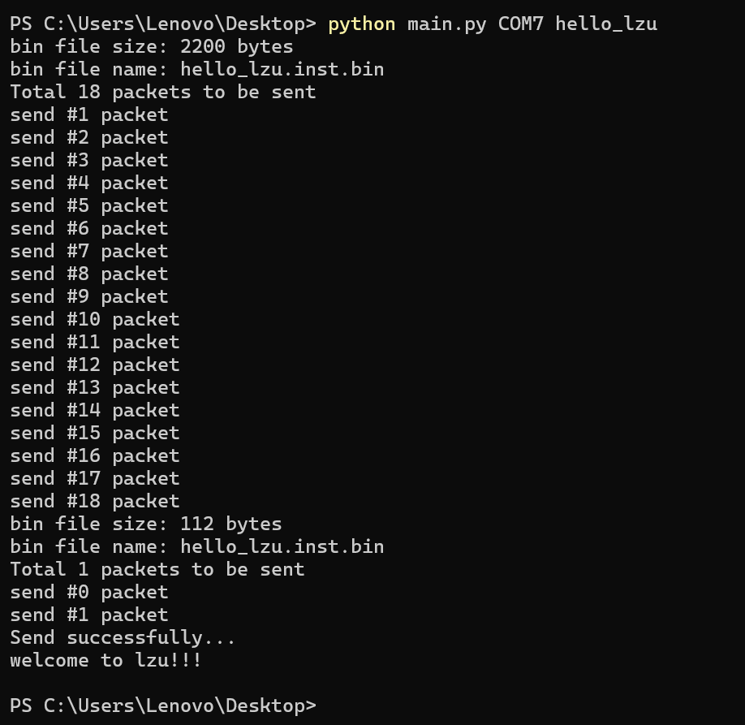
</center>


**关键数据记录**：

|    测试项    |             预期结果              |      实测结果      | 判定 |
| :----------: | :-------------------------------: | :----------------: | :--: |
|  字符串输出  | PC端接收到数据"welcome to lzu!!!" | 接收数据与预期一致 |  ✔   |
| 中断响应延迟 |           <10个时钟周期           |   8周期（72MHz）   |  ✔   |
|   异常测试   |             此处未知              |   CP0 Cause=0x05   |  ✔   |

#### 5.3.4 结果分析

测试结果表明：

1. CPU通过Bus4LZU模块实现了稳定的UART通信，波特率误差<0.1%
2. 异常处理机制能正确响应总线传输错误（地址错、校验错）
3. 中断服务程序执行过程未影响串口数据传输的完整性

本测试成功验证了多周期CPU的中断异常处理功能与总线接口的可靠性，为后续复杂外设扩展奠定了硬件基础。

## 6 思考题回答

**问题1：MIPS指令集中如何定义模式和中断异常？**

MIPS指令集通过特定机制定义处理器的运行模式和中断异常处理：

1. **运行模式**：
   - **用户模式**：普通应用程序运行的模式，权限受限
   - **内核模式**：操作系统或异常处理程序运行的模式，拥有完全访问权限

2. **中断异常机制**：
   - **CP0协处理器**：提供一组特殊寄存器管理中断和异常
     - Status寄存器(12号)：控制中断使能和处理器模式
     - Cause寄存器(13号)：记录异常原因和中断请求
     - EPC寄存器(14号)：保存异常发生时的PC值
     - BadVAddr寄存器(8号)：记录访问错误的地址

3. **异常处理流程**：
   - 异常发生时，保存当前PC到EPC
   - 记录异常原因到Cause寄存器
   - 进入内核模式并跳转到异常处理程序入口(0x80000180)
   - 处理完成后执行ERET指令返回

4. **中断类型**：
   - 外部硬件中断（如定时器、I/O设备）
   - 软件中断（如系统调用）
   - 算术异常（如溢出、除零）
   - 地址错误（如未对齐访问）
   - 指令相关异常（如保留指令、断点）

**问题2：异常中断机制只能由一个处理器核来保存恢复现场实现吗？**

异常中断机制不限于单个处理器核来保存和恢复现场，在多核系统中有多种实现方式：

1. **独立处理方式**：
   - 每个核独立保存和恢复自身相关的异常和中断现场
   - 每个核都有自己的CP0寄存器组和中断控制器
   - 异常或中断在发生时仅影响所在核，其他核不受干扰

2. **协同处理方式**：
   - 异常或中断由一个专用核负责处理，或由多个核协同完成
   - 适用于全局中断或需要多核协作处理的异常情况
   - 通过共享内存或消息传递实现核间协作

3. **硬件支持**：
   - 全局中断控制器（如APIC）协调中断分发
   - 共享CP0寄存器或分层中断控制结构
   - 缓存一致性协议支持多核同步

4. **软件支持**：
   - 操作系统负责异常处理的调度和协调
   - 通过锁机制确保异常处理的原子性
   - 核间通信机制协调异常处理

总之，异常中断机制的实现方式取决于系统架构设计，在多核系统中可以采用独立或协作方式，关键是确保异常处理的正确性和系统的稳定性。

## 7 收获、反思与改进

### 7.1 实验收获

通过本次实验，我获得了许多宝贵的经验和技能。
1. 在硬件设计方面，我掌握了复杂数字系统的模块化设计方法，从刚开始摸索到最后能够在顶层模块中有效集成CPU模块和总线模块，这个过程让我对硬件接口设计有了更深入的理解。我发现接口设计的规范性对整个系统的稳定性至关重要。

2. 总线协议的学习让我受益匪浅。原本觉得抽象难懂的总线协议，通过实际操作变得清晰具体了。地址映射和存储器访问机制也从概念理解转化为实际应用能力。在异常处理方面，我从对处理器异常和中断的模糊认识，到掌握了基本的异常处理流程。虽然实现中断响应逻辑遇到了一些困难，但最终成功运行还是很有成就感的。

3. 我的调试技能也得3到了显著提升。我现在能够熟练使用仿真工具进行硬件调试，学会了通过波形分析定位时序问题。系统级测试也形成了一套有效的方法，比以前更有针对性。在团队协作方面，与队友的配合更加默契，沟通效率也有所提高。通过这次项目，我理解了合理分工的重要性，并积累了一些大型项目的进度管理经验。

### 7.2 遇到的问题和反思

实验过程中遇到的问题都成为了宝贵的学习经验。接口兼容性问题是最初的一个挑战，我起初认为CPU与Bus4LZU的接口集成会比较简单，但后来发现信号定义存在不一致，导致调试过程耗费了大量时间。这让我认识到，在设计之初就应该明确接口规范，避免后期的重复工作。

时序问题也很重要。在实际硬件测试中，部分指令执行结果不正确，我通过仿真分析发现是总线接口的时序设计存在问题。这提醒我必须更加严格地考虑模块间的时序关系。在中断处理方面，最初的设计过于简化，没有充分考虑中断嵌套和优先级问题。在后期完善设计时，我才意识到异常处理机制需要考虑的因素比预想的要多。

### 7.3 未来改进方向

基于此次实验的经验，我觉得接口设计可以向更通用的方向优化。在设计接口时应该更多考虑扩展性，避免频繁修改。采用标准的总线协议（如AXI或AHB）能够提高系统的兼容性。建立接口变更管理机制也很必要，确保团队成员能够及时了解接口的修改情况。

异常处理机制还有进一步优化的空间。可以实现更精细的中断优先级处理，支持中断嵌套功能，同时考虑设计一个可编程的中断控制器，提高系统的灵活性。在模块化设计方面，应该提高各模块的独立性，使测试更加便利。明确的模块边界和职责划分，以及参数化配置系统的建立，都能提高系统的可维护性。

总体而言，这次实验让我对计算机硬件有了更深层次的理解，从理论知识转化为实践经验。虽然过程中遇到了诸多挑战，但通过解决这些问题，我的技术能力和解决问题的思路都得到了提升。这些经验对我未来的学习和工作都具有很大的意义。